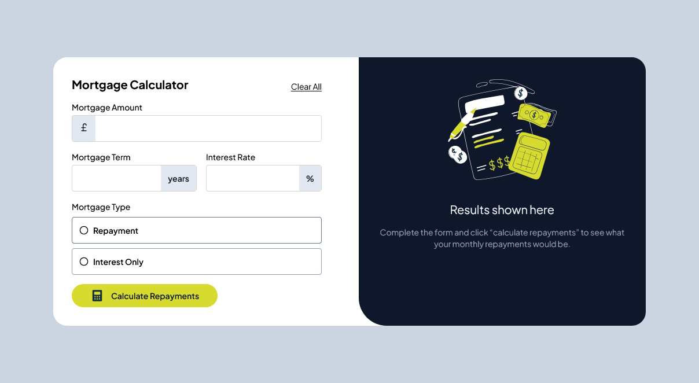

# Frontend Mentor - Mortgage Repayment Calculator Solution

This is a solution to the [Mortgage Repayment Calculator challenge on Frontend Mentor](https://www.frontendmentor.io/challenges/mortgage-repayment-calculator-Galx1LXK73). Frontend Mentor challenges help you improve your coding skills by building realistic projects.

## Table of contents

- [Overview](#overview)
  - [The challenge](#the-challenge)
  - [Screenshot](#screenshot)
  - [Links](#links)
- [My process](#my-process)
  - [Built with](#built-with)
  - [What I learned](#what-i-learned)
  - [Continued development](#continued-development)
  - [Useful resources](#useful-resources)
- [Author](#author)
- [Acknowledgments](#acknowledgments)

## Overview

### The challenge

Users should be able to:

- Input mortgage information and see monthly repayment and total repayment amounts after submitting the form
- See form validation messages if any field is incomplete
- Complete the form only using their keyboard
- View the optimal layout for the interface depending on their device's screen size
- See hover and focus states for all interactive elements on the page

### Screenshot



### Links

- Solution URL: [Add solution URL here](https://your-solution-url.com)
- Live Site URL: [Add live site URL here](https://your-live-site-url.com)

## My process

### Built with

- Semantic HTML5 markup
- CSS custom properties
- Flexbox
- Mobile-first workflow
- [React](https://reactjs.org/) - JS library
- [Zod](https://zod.dev/) - Schema validation
- [Lucide](https://lucide.dev/) - Icon set

### What I learned

Throughout this project, I gained a deeper understanding of using Zod for schema validation in React. Handling form state and validation in a structured way improved the user experience and made the form more robust. I also refined my skills in creating responsive and interactive UI components.

Here are some code snippets that highlight my learnings:

```js
const mortgageSchema = z.object({
  amount: z.number().min(1, { message: "Amount is required" }),
  term: z.number().min(1, { message: "Term is required" }),
  rate: z.number().min(0.1, { message: "Rate is required" }),
  type: z.enum(["Repayment", "Interest Only"], {
    message: "This field is required",
  }),
});
```

```js
const calculateRepayments = (amount, term, rate, type) => {
  const monthlyRate = rate / 100 / 12;
  const numberOfPayments = term * 12;
  let monthlyPayment;

  if (type === "Repayment") {
    monthlyPayment =
      (amount * monthlyRate) / (1 - (1 + monthlyRate) ** -numberOfPayments);
  } else {
    monthlyPayment = amount * monthlyRate;
  }

  const totalRepayment = monthlyPayment * numberOfPayments;
  return {
    monthlyPayment: monthlyPayment.toFixed(2),
    totalRepayment: totalRepayment.toFixed(2),
  };
};
```

### Continued development

In future projects, I want to continue improving my form handling skills, especially in large forms with complex validation requirements. Additionally, I aim to deepen my knowledge of state management in React, possibly exploring libraries like Redux or Zustand.

### Useful resources

- [Zod Documentation](https://zod.dev/) - The official documentation for Zod, which helped me implement and understand schema validation.
- [React Documentation](https://reactjs.org/docs/getting-started.html) - The official React documentation is always a great resource for understanding and troubleshooting React concepts.

## Author

- Website - [Yasin Walum](https://ywalum.com)
- Frontend Mentor - [@wyasyn](https://www.frontendmentor.io/profile/wyasyn)
- Twitter - [@wyasyn](https://www.twitter.com/wyasyn)

## Acknowledgments

Thanks to the Frontend Mentor community for providing such a great platform to improve coding skills through practical projects. Special thanks to [resource or person] for their support and guidance throughout this project.
